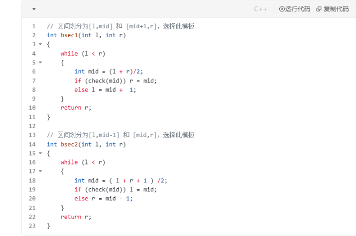

```
public int search(int[] nums, int target) {
    int l = 0, r = nums.length - 1;
    while (l < r) {
        int mid = (l + r) / 2;
        if (nums[mid] >= target) r = mid;
        else l = mid + 1;
    }
    return nums[r] != target ? -1 : r;
}
```
这段代码实现的是二分查找算法，目的是在有序数组 `nums` 中查找目标值 `target`。代码最后返回 `r` 而不是 `l`，但实际上，在循环结束时，`l` 和 `r` 的值是相等的，因此返回 `r` 或 `l` 在功能上是完全相同的。

### 原因分析：
1. **循环条件**：循环条件是 `while (l < r)`，这意味着当 `l` 和 `r` 相遇（即 `l == r`）时，循环结束。因此，在循环退出后，`l` 和 `r` 总是指向同一个索引位置。
2. **算法逻辑**：在每次迭代中，算法通过调整 `l` 或 `r` 来缩小搜索范围：
    - 如果 `nums[mid] >= target`，则设置 `r = mid`，说明目标值可能在左半部分。
    - 否则，设置 `l = mid + 1`，说明目标值可能在右半部分。
      这种调整方式确保了当循环结束时，`l` 和 `r` 指向的位置是第一个大于等于 `target` 的元素索引（如果存在）。
3. **返回值**：由于 `l` 和 `r` 相等，返回 `r` 或 `l` 没有区别。代码中选择返回 `r` 可能是出于编码风格或个人偏好，并不影响正确性。

### 示例验证：
假设 `nums = [1, 2, 3, 4, 5]`，`target = 3`：
- 初始：`l = 0`, `r = 4`
- 第一次迭代：`mid = 2`，`nums[2] = 3 >= 3`，所以 `r = 2`（现在 `l = 0`, `r = 2`）
- 第二次迭代：`mid = 1`，`nums[1] = 2 < 3`，所以 `l = 2`（现在 `l = 2`, `r = 2`，循环结束）
- 返回 `r = 2`，因为 `nums[2] == 3`，所以返回 `2`。如果返回 `l`，也是 `2`。

同样，如果 `target` 不在数组中，循环结束时 `l` 和 `r` 也相等，返回 `r` 或 `l` 都会正确返回 `-1`。

### 结论：
代码返回 `r` 而不是 `l` 并不会影响算法的正确性，因为两者在循环结束时值相同。你可以放心地使用返回 `r` 的写法，如果需要，也可以改为返回 `l`，结果是一样的。这种写法是二分查找的一种常见变体，用于找到第一个大于等于 `target` 的元素位置。




好的，根据您提供的图片，我来为您详细解释这两种二分查找模板的不同之处，以及为什么不能只死记硬背一种模板。

这两种模板是二分查找实现中两种经典且互补的“板子”，它们最核心的区别在于**区间的划分方式**和**中间点 `mid` 的归属**，这直接导致了 `mid` 的计算和边界更新方式的不同。

### 两种模板的核心区别

| 特性 | 模板一 (bsec1) | 模板二 (bsec2) |
| :--- | :--- | :--- |
| **区间划分** | `[l, mid]` 和 `[mid+1, r]` | `[l, mid-1]` 和 `[mid, r]` |
| **`mid` 计算** | `mid = (l + r) / 2` (**向下取整**) | `mid = (l + r + 1) / 2` (**向上取整**) |
| **边界更新** | `if (check(mid)) r = mid;` <br> `else l = mid + 1;` | `if (check(mid)) l = mid;` <br> `else r = mid - 1;` |
| **适用场景** | 寻找**第一个**满足条件的元素<br>(例如：查找起始位置) | 寻找**最后一个**满足条件的元素<br>(例如：查找结束位置) |
| **循环不变性** | `l` 左边的元素**都不满足**`check`条件<br>`r` 右边的元素**都满足**`check`条件 | `l` 左边的元素**都满足**`check`条件<br>`r` 右边的元素**都不满足**`check`条件 |

---

### 为什么不能只记一种？

**绝对不行。** 只记住一种模板在很多情况下会出错，最常见的就是导致**无限循环（Infinite Loop）**。

我们通过一个具体例子来看：
假设有一个数组 `nums = [1, 2, 2, 2, 3]`，我们要查找目标值 `2`。
- 如果你想找到**第一个** `2`（即左边界），你应该使用**模板一**。
- 如果你想找到**最后一个** `2`（即右边界），你应该使用**模板二**。

**如果你在找右边界时错误地使用了模板一：**

1.  初始状态：`l = 0`, `r = 4`
2.  第一次循环：`mid = (0+4)/2 = 2`。`nums[2] == 2` 满足 `check`（即 `>= target`），所以执行 `r = mid = 2`。
3.  现在 `l=0`, `r=2`。
4.  第二次循环：`mid = (0+2)/2 = 1`。`nums[1] == 2` 满足 `check`，所以执行 `r = mid = 1`。
5.  现在 `l=0`, `r=1`。
6.  第三次循环：`mid = (0+1)/2 = 0`。`nums[0] == 1` **不满足** `check`，所以执行 `l = mid + 1 = 1`。
7.  现在 `l=1`, `r=1`，循环条件 `l < r` 不成立，退出循环。
8.  返回 `r=1`。**结果是第一个 `2` 的位置，而不是最后一个 `2` 的位置。**

这只是一个逻辑错误，更糟糕的是在另一种情况下会导致死循环：

**假设某次循环 `l = 3`, `r = 4`：**
- 使用模板一：`mid = (3+4)/2 = 3`。如果条件不成立，`l = mid + 1 = 4`，循环结束。**没问题。**
- 如果错误地在此处使用模板二：`mid = (3+4+1)/2 = 4`。如果条件成立，`l = mid = 4`，循环结束。**没问题。**
- **但是，** 如果 `l` 和 `r` 相邻（例如 `l=2, r=3`），且 `check(mid)` 条件为真，使用模板二会导致 `l = mid`，而 `mid` 因为向上取整等于 `3`，状态从 `(2,3)` 变为 `(3,3)`，循环结束。
- **最危险的情况**：如果使用模板二的公式 `mid = (l + r + 1) / 2` 但采用了模板一的更新逻辑 `r = mid`，在 `l` 和 `r` 相邻时，`mid` 会永远等于 `r`，如果条件一直成立，就会不断执行 `r = mid = r`，自己赋值给自己，导致**无限循环**。

### 结论与建议

1.  **必须掌握两种模板**：这两种模板解决的是不同性质的问题。模板一用于寻找**左边界**（第一个满足条件的），模板二用于寻找**右边界**（最后一个满足条件的）。它们是互补的，而非替代的。

2.  **理解优于死记**：不要死记代码。而是要理解其背后的“循环不变性”原理：
   - **模板一**：保证退出循环时，`l` 或 `r` 指向的是**第一个**满足 `check` 条件的元素。
   - **模板二**：保证退出循环时，`l` 或 `r` 指向的是**最后一个**满足 `check` 条件的元素。

3.  **如何选择**：在解决问题时，先问自己：“我到底要找的是第一个还是最后一个满足条件的值？” 根据答案来选择模板。

4.  **记忆技巧**：可以只重点记忆一种（比如模板一），但必须理解另一种是如何推导出来的。当你需要模板二时，可以想象成是在一个修改过的条件下使用模板一的逻辑。但最稳妥的方法还是同时理解并记忆这两种标准实现。

总而言之，只记住一种模板就像只有一把钥匙，却想打开所有类型的锁，这是行不通的。熟练掌握这两种模板，才能从容应对所有二分查找相关的题目。