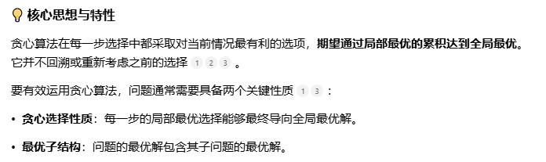
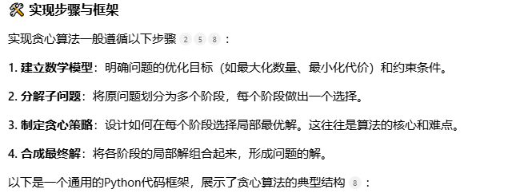
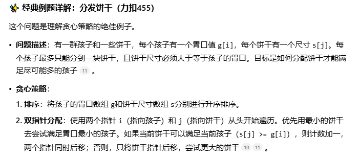
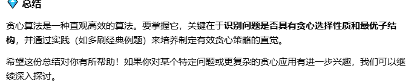

```agsl
def greedy_algorithm(problem):
    # 1. 初始化解集合
    solution = []
    # 2. 对候选集合进行预处理，如排序
    candidates = sorted(problem.candidates, key=lambda x: x.value)  # 根据具体策略排序
    # 3. 迭代选择
    for candidate in candidates:
        # 4. 检查候选是否可行（满足约束）
        if is_feasible(solution, candidate):
            # 5. 将候选加入解集合
            solution.append(candidate)
    # 6. 返回最终解
    return solution
```


```agsl
def findContentChildren(g, s):
    g.sort()  # 孩子胃口排序
    s.sort()  # 饼干大小排序
    i, j = 0, 0  # 初始化双指针
    count = 0
    while i < len(g) and j < len(s):
        if s[j] >= g[i]:  # 当前饼干能满足当前孩子
            count += 1
            i += 1  # 满足了一个孩子，指针后移
        j += 1  # 无论是否满足，饼干指针都后移
    return count
```
